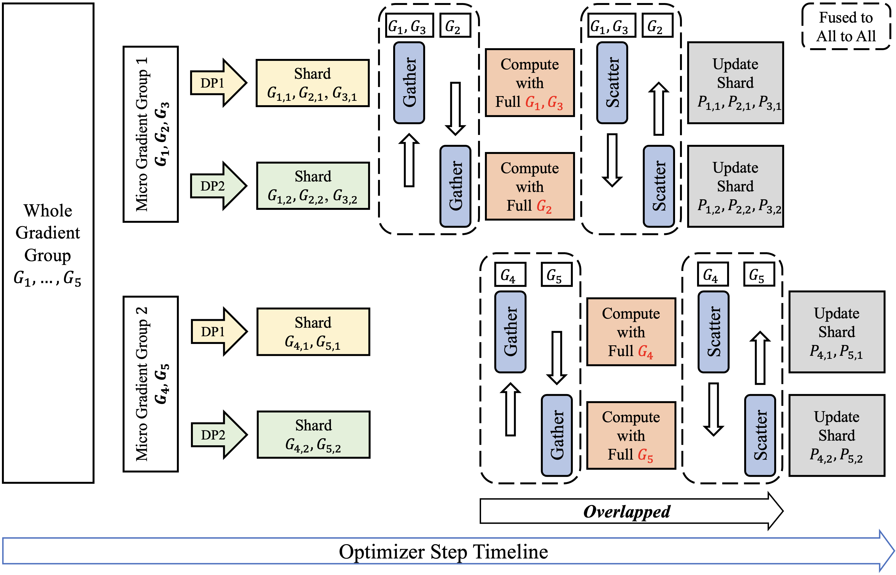

# FSDP-Canzona

FSDP-Canzona is an FSDP-oriented implementation of Canzona for distributed
matrix-based optimizers.

- **Paper:** [Canzona: A Unified, Asynchronous, and Load-Balanced Framework for Distributed Matrix-based Optimizers](https://arxiv.org/html/2602.06079)
- **Megatron implementation:** [liangyuwang/Megatron-Canzona](https://github.com/liangyuwang/Megatron-Canzona)
- **This repository:** an FSDP adaptation of the same optimizer-step idea.

Canzona makes matrix-based optimizers such as Muon and SOAP practical under
distributed sharding. These optimizers need full 2D matrices for operations like
Newton-Schulz orthogonalization or Shampoo-style preconditioning, while FSDP
keeps only per-rank parameter shards. FSDP-Canzona bridges that mismatch by
assigning each full-matrix optimizer task to a host rank, gathering the needed
gradient shards, computing the full update, scattering update shards back, and
then applying the local shard update.



The design mirrors the Megatron-Canzona TP path: both TP and FSDP split each
parameter uniformly across ranks, so the same gather -> compute -> scatter ->
update schedule can be reused with FSDP process groups and shard metadata.

## Key Ideas

- **Full-matrix optimizer compute:** Muon/SOAP run on reconstructed full 2D
  gradients, not on partial shards.
- **Logical host assignment:** each matrix update is assigned to one rank for
  compute, independent of where the parameter shard physically lives.
- **Micro-group scheduling:** parameters are grouped so gather, compute,
  scatter, and local update can be pipelined and load-balanced.
- **Fused communication path:** shard movement can use fused `all_to_all_single`
  when enabled.
- **Optional parameter splitting:** QKV, FC1, and linear-attention input
  projections can be split into smaller 2D matrices before optimization.

## Package Layout

```text
matrix_based_optimizer/
├── load_balanced_fsdp_executor.py  # FSDP gather/compute/scatter/update executor
├── split_grad_and_state.py         # QKV/FC1/in-proj split and reassembly helpers
├── utils.py                        # parameter tagging and cost estimates
└── optimizers/
    ├── base_optim.py               # common optimizer orchestration
    ├── muon.py                     # Muon kernel
    └── soap.py                     # SOAP kernel
```

## FSDP Contract

FSDP-Canzona intentionally avoids relying on PyTorch FSDP private internals. The
training stack provides shard metadata either through parameter attributes or
param-group fields.

```python
param_group = {
    "params": local_matrix_shards,
    "use_muon": True,
    "is_fsdp_sharded": True,
    "fsdp_group": process_group,          # optional; defaults to WORLD
    "fsdp_full_shapes": full_shapes,      # list[torch.Size], one per param
    "fsdp_local_shapes": local_shapes,    # optional; defaults to p.shape
    "fsdp_shard_dims": shard_dims,        # optional; defaults to 0
}
```

Equivalent per-parameter attributes are also accepted:

```python
p.fsdp_full_shape = torch.Size([hidden_out, hidden_in])
p.fsdp_local_shape = p.shape
p.fsdp_shard_dim = 0
```

The current implementation assumes uniform per-parameter sharding:

```text
full_shape[shard_dim] == local_shape[shard_dim] * fsdp_world_size
```

All non-sharded dimensions must match exactly.

## Usage Sketch

```python
from matrix_based_optimizer import Muon

optimizer = Muon(
    [
        {
            "params": matrix_shards,
            "use_muon": True,
            "is_fsdp_sharded": True,
            "fsdp_group": fsdp_group,
            "fsdp_full_shapes": full_shapes,
            "fsdp_local_shapes": local_shapes,
            "fsdp_shard_dims": shard_dims,
            "fsdp_balance": "global",     # "no", "single", "slot", "global"
            "fsdp_fused_comm": True,      # use all_to_all_single
            "fsdp_balance_cost": "flops", # or "numel"
            "fsdp_overlap": "full",       # "none" keeps the serial path
            "fsdp_log_visualization": True, # optional one-time load report
        }
    ],
    lr=1e-3,
)
```

For non-sharded local parameters, the optimizers behave like regular
`torch.optim.Optimizer` subclasses.

## Example Scripts

See [`scripts/canzona/README.md`](scripts/canzona/README.md) for runnable toy
alignment checks on a tiny causal Transformer LM built from PyTorch modules.
The main script compares FSDP-Canzona shard updates against a replicated
full-matrix baseline, which is equivalent to single-rank training or DDP after
gradient all-reduce:

```bash
torchrun --standalone --nproc-per-node=2 \
  scripts/canzona/example.py \
  --optimizer muon \
  --device cuda \
  --backend nccl \
  --overlap full \
  --steps 4
```

For batch alignment runs:

```bash
NPROC_PER_NODE=2 DEVICE=cuda BACKEND=nccl bash scripts/canzona/align.sh
```

## Current Status

- FSDP-oriented executor and Muon/SOAP integration are implemented.
- Megatron TP-specific dependencies have been removed from the main path.
- Cross-world-size optimizer-state checkpoint remapping is not implemented yet.
- CUDA graph capture is disabled for the FSDP communication path.

## Citation

If you use this project, please cite the Canzona paper:

```bibtex
@misc{wang2026canzona,
  title        = {Canzona: A Unified, Asynchronous, and Load-Balanced Framework for Distributed Matrix-based Optimizers},
  author       = {Wang, Liangyu and Zhang, Siqi and Wang, Junjie and Dong, Yiming and Zheng, Bo and Qiu, Zihan and Tang, Shengkun and Wang, Di and Men, Rui and Liu, Dayiheng},
  year         = {2026},
  eprint       = {2602.06079},
  archivePrefix = {arXiv},
  primaryClass = {cs.DC},
  doi          = {10.48550/arXiv.2602.06079},
  url          = {https://arxiv.org/abs/2602.06079}
}
```
